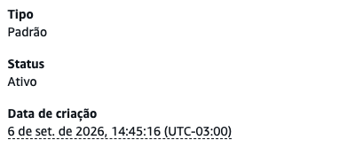
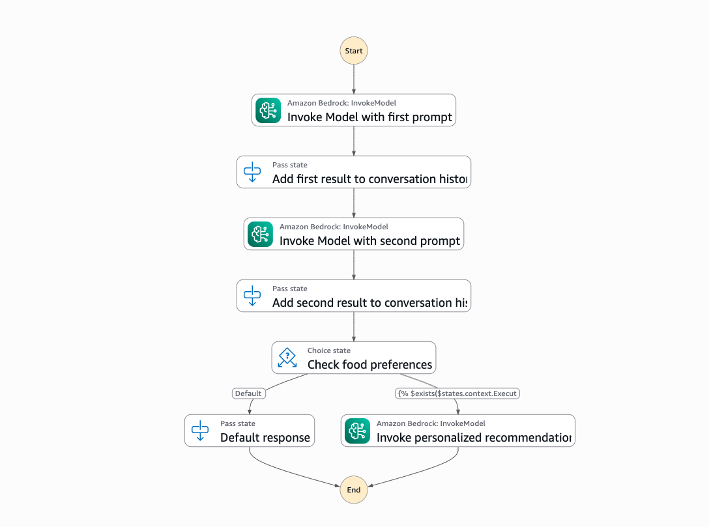
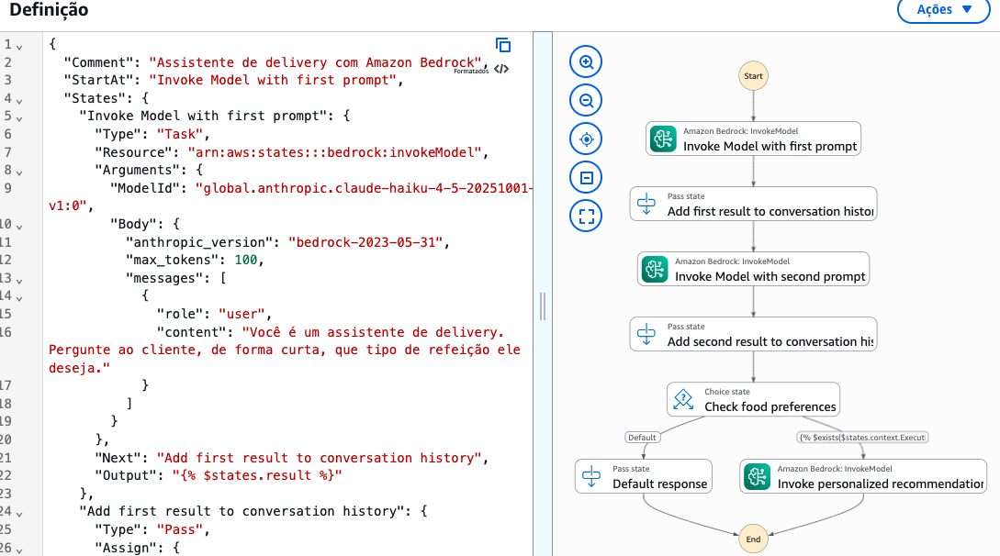
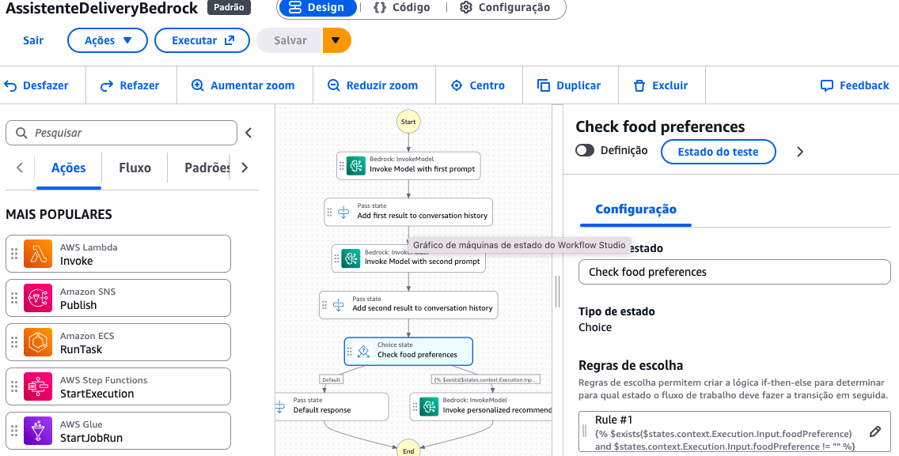
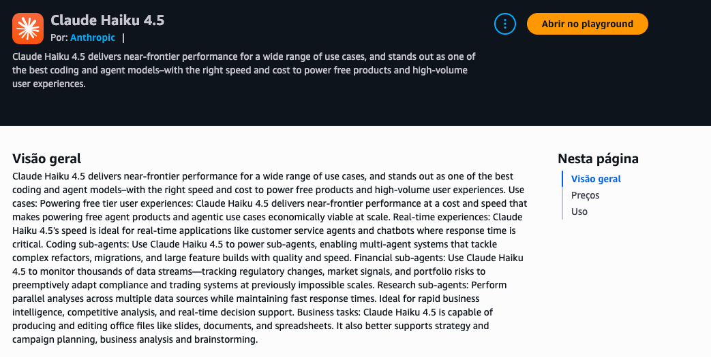
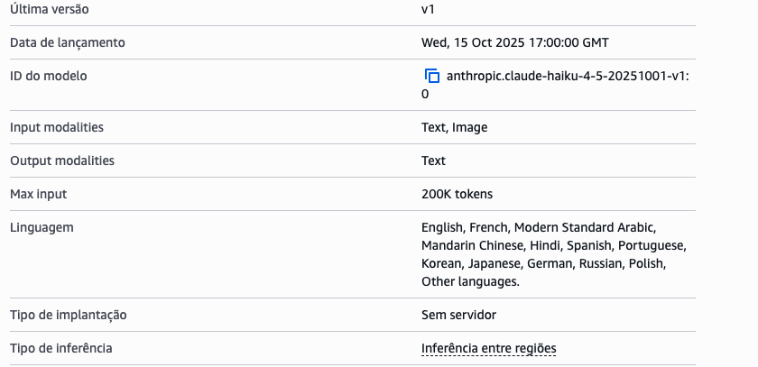

# Assistente de Delivery com AWS Step Functions e Amazon Bedrock

Projeto desenvolvido como parte de um desafio prático da *DIO, com o objetivo de criar um assistente de delivery utilizando **AWS Step Functions* para orquestração do fluxo e *Amazon Bedrock* para interação com um modelo de Inteligência Artificial Generativa.

## Objetivo

O projeto demonstra como utilizar uma máquina de estados serverless para coordenar diferentes etapas de uma conversa com um assistente de delivery.

O fluxo foi estruturado para:

- iniciar uma interação com o usuário;
- enviar prompts para um modelo via Amazon Bedrock;
- armazenar informações intermediárias da conversa;
- identificar preferências alimentares;
- tomar decisões utilizando um estado Choice;
- gerar uma recomendação personalizada quando houver preferência informada;
- retornar uma resposta padrão quando nenhuma preferência for identificada.

## Tecnologias utilizadas

- AWS Step Functions
- Amazon Bedrock
- Claude Haiku 4.5
- AWS IAM
- GitHub

## Máquina de estado

A máquina de estado criada recebeu o nome:

```text
AssistenteDeliveryBedrock
```

## Fluxo da máquina de estado

O fluxo implementado segue esta lógica:

```text
Start
  ↓
Invoke Model with first prompt
  ↓
Add first result to conversation history
  ↓
Invoke Model with second prompt
  ↓
Add second result to conversation history
  ↓
Check food preferences
  ├── preferência encontrada
  │       ↓
  │   Invoke personalized recommendation
  │       ↓
  │      End
  │
  └── preferência não encontrada
          ↓
      Default response
          ↓
         End
```

## Modelo utilizado

O modelo configurado para as chamadas no workflow é o *Claude Haiku 4.5*, da Anthropic.

No AWS Step Functions foi utilizado o identificador global:

```text
global.anthropic.claude-haiku-4-5-20251001-v1:0
```

O catálogo do Amazon Bedrock apresenta o identificador base:

```text
anthropic.claude-haiku-4-5-20251001-v1:0
```

## Definição da máquina

A definição completa da máquina de estado em Amazon States Language está disponível em:

step-functions/assistente-delivery-bedrock.asl.json

## Evidências

### Máquina de estado




### Workflow completo



### Definição do Step Functions



### Verificação de preferência alimentar



### Modelo utilizado no Amazon Bedrock



### Identificador do modelo



## Status dos testes

A máquina de estado foi criada com sucesso no AWS Step Functions.

No momento da implementação inicial, o Amazon Bedrock ainda estava em processo de verificação da conta AWS. Por esse motivo, ainda não foi realizada uma execução real da máquina de estado utilizando o modelo.

Após a liberação do acesso, serão testados os dois principais caminhos:

1. usuário com preferência alimentar;
2. usuário sem preferência alimentar.

Essa abordagem evita chamadas desnecessárias ao modelo enquanto o acesso ao serviço ainda está sendo validado.

## Cuidados com custos

Durante o desenvolvimento, foram evitadas execuções desnecessárias dos serviços AWS.

A estratégia adotada foi:

- criar e revisar a máquina de estado antes de executar;
- documentar o fluxo antes dos testes;
- evitar chamadas ao Bedrock durante a verificação da conta;
- realizar apenas execuções controladas quando o acesso estiver disponível;
- testar somente os dois caminhos principais do workflow.

## Conceitos praticados

- AWS Step Functions
- Amazon States Language
- estados Task
- estados Pass
- estado Choice
- integração com Amazon Bedrock
- IA Generativa
- engenharia de prompts
- fluxo condicional
- persistência de contexto entre etapas
- IAM Roles
- arquitetura serverless
- controle de custos em serviços AWS

## Próximos passos

- [x] Criar máquina de estado no AWS Step Functions
- [x] Configurar chamadas ao Amazon Bedrock
- [x] Implementar armazenamento do histórico da conversa
- [x] Criar lógica condicional baseada em preferência alimentar
- [x] Configurar recomendação personalizada
- [x] Configurar IAM Role
- [x] Salvar definição ASL no GitHub
- [x] Registrar evidências do projeto
- [ ] Validar acesso ao Amazon Bedrock
- [ ] Executar cenário com preferência alimentar
- [ ] Executar cenário sem preferência alimentar
- [ ] Registrar evidências das execuções

## Aprendizados

Este projeto permitiu compreender como o AWS Step Functions pode ser utilizado para orquestrar interações com modelos de Inteligência Artificial Generativa.

Os estados Pass ajudam a organizar informações intermediárias, enquanto o estado Choice permite criar caminhos diferentes de execução com base nos dados da conversa.

A integração com o Amazon Bedrock permite adicionar capacidade de interpretação e geração de respostas ao workflow, mantendo a lógica de orquestração centralizada no AWS Step Functions.

## Projeto

Desafio prático desenvolvido durante formação da *DIO, utilizando serviços da **Amazon Web Services (AWS)*.


AssistenteDeliveryBedrock
